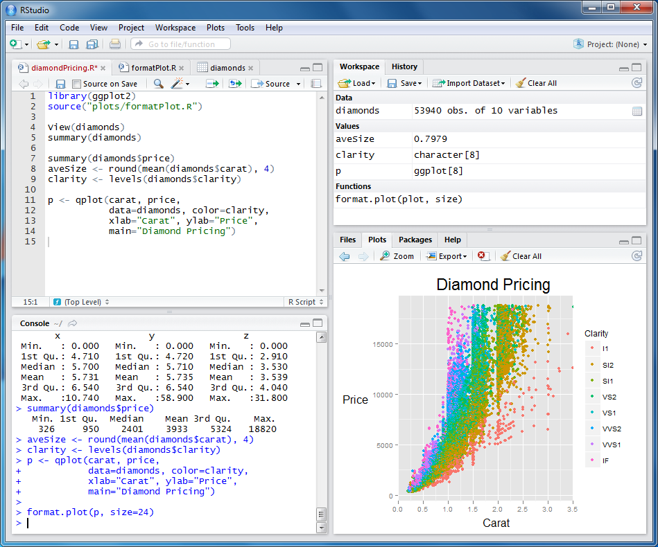

```{css, echo = F}
kbd {
    background-color: #eee;
    border-radius: 3px;
    border: 1px solid #b4b4b4;
    box-shadow: 0 1px 1px rgba(0, 0, 0, .2), 0 2px 0 0 rgba(255, 255, 255, .7) inset;
    color: #333;
    display: inline-block;
    font-size: .85em;
    font-weight: 700;
    line-height: 1;
    padding: 2px 4px;
    white-space: nowrap;
}

# This ccs code is to create the pretty keyboard symbols. Taken from this SO question:
# https://stackoverflow.com/questions/58506641/how-can-i-use-htmls-kbd-tag-on-rmarkdown
```

```{r setup, include=FALSE}
# To create the Rmarkdown document
library(knitr)
# Data manipulation
library(tidyverse)

knitr::opts_chunk$set(dpi = 320, width = 150, fig.width = 16, fig.height = 9, 
                      warning = FALSE, message = F, tinytex.verbose = TRUE)
```

## Introduction

There are learning curves, and then, there are learning walls. Proficiency in R is a learning wall. When I began my journey, I stood in front of that wall, dazed as I realized that the top of the wall blended seamlessly into the sky above. How was I suppose to transcend that? I did not have a computer programming background. My knowledge revolved around fish husbandry and experimentation. But, I knew I had to learn the language. I wanted to make the most out of the data that I collected, to either provide it for others to easily use or to analyze it for others to easily understand. For both goals, R was touted as the path forward.

I started scaling the wall using the resources at my disposal: coworkers, Google, and the ultimate weapon, Stack Overflow. Little by little, I started scaling the wall. Little by little, I realized that I was scaling the wall sideways instead of vertically. The problem was my coworkers, Google, and Stack Overflow offerred me many different solutions to tackle the same problem. After dealing with one problem, searching how to solve the next problem was again an explosion of different options to choose from. It was overwhelming.

Fast forward to now, looking back, I believe what would have helped me better learn R was a definite guide on how to approach various operations. Instead of a rainbow of options to scale the wall sideways, having just one option that worked well would have been more productive. Like all things, learning R is a function of how many times you bang your head against the wall. This is more efficient with a how-to guide. So, I present to you a guide on how to bang your head against the wall, a guide to general data manipulations in R.

## Focus and goals

The topics covered in this guide will center around the Smelt Larval Survey publication process. Most functions used in that process will be featured here. I have assumed that if you are reading this, that you have just began dipping your toes into R. My goals of this guide are to provides you with enough background and information to: 1) begin learning R join the dark side and 2) begin understanding the logic behind the manipulations in the SLS publication system. 

## Getting started in R

### Installing R and RStudio

R is a coding language which requires an application to run. The most popular program to run R is RStudio. To get things working, install both R (https://cran.r-project.org/bin/windows/base/) and RStudio (https://www.rstudio.com/products/rstudio/download/). For the purpose of data stewardship, you will install both 32-bit and 64-bit R (same installer, chosen during installation) and 64-bit RStudio (default installer). Both programs have been whitelisted by IT, so you can download and install them on your own. Once installed, RStudio will automatically detect your R version (do not specify an alternate installation path for R).

### Working in RStudio



R Studio has four panels, which by default will have the editor in the top left, the environment in the top right, the console in the bottom left, and the plot, file explorer, package, andd help panels in the bottom right (Figure 1). The editor is where you will write your script to be saved; the environment is where your coded objects will be housed; the console is where your script is executed and outputted; and the bottom right panel will contain a mixture of information specific to your outputs or project.

## Installing packages

Packages are what makes R such a powerful program. The language is open source and allows anyone to become a developer. This means that the program is not only extremely flexible (a package for everything) but is also future-proof (packages updated and maintained by the authors independent of the core R team). The R program comes with several packages preinstalled. These are called "base" packages, making up "base R". You can add additional packages in two ways: 1) using the `install.packages()` function

```{r packages, eval=F}
# Functions from this tidyverse package will be used throughout the remainder of this document.
install.packages("tidyverse")
```

or 2) using the "Packages" tab in the lower right corner of RStudio (default location). In that tab, the "Install" and "Update" options will bring up a user interface for you to search for the package(s) of interest. It is best practice to install packages on a fresh run of R or RStudio (immediately after start up) to prevent conflicts with components/packages already loaded (which can prevent a package from installing).

Once installed, you must then run the package in your session to access the accompanying functions via:

```{r library, eval=F}
# Loading a package, or a "library" of functions
library(tidyverse)
```

## Coding style

A script should be coded in such a way that it is easy to follow and read. This will be interpreted differently across all users. However, there are popular styles out there that people have gravitated towrads. For R, two popular styles are the [tidyverse style](https://style.tidyverse.org/) and [Google's style](https://google.github.io/styleguide/Rguide.html). Fortunately, both of these styles are derivations from each other, and I recommend you to simply start with the tidyverse link. The word "start" is key here, because you will likely have personal preferences that will ultimately curate a style that is unique to you. As long as your style is easy to follow and read, this should not be a problem.

In the following guide, the examples will be written in my style of coding. I believe you should take away from my style anything that you think makes the code clearer and change anything that fails to do so.

## General syntax of R

R has several fundamental components that all users should be familiar with.

### Comments

An R script can contain code *and* comments. Comments are narratives that the authors write within the script. A line of comment is preceded by the symbol `#` followed by any text. It is best practice to comment your code as you go to help explain your approaches for the future you or your users. I have learned that it *is* worth making the extra effort to write in complete sentences and thoughts, because the you that is coding a section is likely smarter than the you that will be reading that section.

```{r comments}
# This is a comment
# Can be any text following the hashtag, 1 2 3?
c("This is code")
# c("This is a comment")
```

### Objects

An `object` refers to anything that becomes housed in the environment (top right panel by default in RStudio). This can range from a singular value, a vector of values, a list of values, a data frame, a plot, a function, etc. The general formula for assigning an object in R is:

```{r objects, eval=F}
nameOfObject <- stuffInObject
```

where the assigned name of an object is generally to the left of the formula, the "<-" symbol is the assignment symbol, and the code that creates the object to the right of the formula.

For example:

```{r object assignment}
# An object with a singular numeric value
objectA <- 5
# An object with a singular character value
objectB <- "5"
# A vector
objectC <- c(5, 6)
# A data frame that cotains two vector, one numeric and the other character
objectD <- data.frame(numbers = c(5, 6),
                      characters = c("5", "6"))
```

Generally, an object in R is made up of the same data type, e.g., a vector of only numbers or character but not a mixture of both. There are rare exceptions to this, such as lists.

### Functions

Functions are used to create your objects in R. A function is a preset sequence of codes that will be executed when invoked. Most functions have internal arguments that you must specify to dictates which sequences of its internal code to execute. These arguments are separated using a comma. When you first explore a function, it is helpful to pull up the help documentation associated with that function. To access the documentation, use ?yourFunction:

```{r functions, eval=F}
# To get the help documentation for the two functions used in the #object section above:
?c
?data.frame()
# For functions from installed packages, you may need to load that package first via library(packageName)
```

This will pull up the documentation in the "Help" tab in the bottom right panel of RStudio. Within that page, you will find details that may include: 1) what package the function is from (e.g., data.frame {base} says that this function is part of R as available after installation, or base R), 2) a description of the function, 3) the possible arguments to specify, 4) various specific details of the function, and generally 5) examples of usage. To ensure the help page loads correctly, makes sure the library of your function is loaded (if it is not part of base R).

Arguments within a function can "default" values that will be used if you does not specify anything. These defaults are provided in the help file, usually with a description. To specify an argument in a function, the `=` symbol is used to assign the value you want. If the default value of an argument is a logical (TRUE/FALSE), then you can only enter those two options; if the default is `NULL` or `NA`, you should consult the help page to see what inputs you can enter; if the default is a combination of several options, e.g., c("Yes", "No", "Maybe"), then you are to choose between those options and consult the help page for what each does; and if the argument is an ellipsis (`...`), then you must consult the help page and realize that an ellipsis allows for multiple separate arguments for that portion of the function. For example:

```{r ellipsis}
# The main argument to the combine function c(...) is the epllipsis (?c). As will be discussed in more details in the combine section, c() creates a vector of the specified values. Since you can have an infinite number of values to combine into a vector, the ellipsis is used. The ellipsis allows you to input multiple arguments that are separated by a comma:
c(1, 2, 3, 4, 5, 6, 7, 8, 9)
# Here, 10 values are combined, but since any number of values can be combined, the ... is used.
```

The ellipsis can be confusing, but is often used to provide a function with additional flexibility. 

### Assignments {#assignment}

In R, assigning refers to the act of giving form to an object. The general assignment symbol in R is `<-`. The `=` symbol can also be used to assign. To avoid confusion, the main difference between the two symbols is that `=` is used to assign objects *within a function* and is related to the arguments within that function, while `<-` is used to assign an object to the *environment*.

### Data types {#dataType}

Data values are represented in several ways in R:

1. numeric (integers, double)
2. character (strings)
3. logical
4. factors
5. date

Numeric data is represented by actual numbers in an R script (e.g., 1, 2, 3). For numeric values, an integer is a whole number while a double value can contain decimal points to the 14th decimal points (field size/float size). Character data is represented by quotations, and a string is simply a sequence of characters values. Logical values are either TRUE/FALSE. Factors are data that belong to specific groups, in which the grouping must be preserved. For example:

```{r factors}
# A vector of ratings can be specified as a level. If you apply this ranking to how tasty recipes of a food item is, then it would be important to know to which group of these rankings a recipe belongs:
factor(c("worse", "ok", "good", "best"),
       # the `levels = ` argument is the specific groupings and order that you want
       # R will automatically specify your levels if you do not manually do this. For things in alphabetical order, this might be ok, but it is good practice to specify the order of your levels if order is important
       levels = c("worse", "ok", "good", "best"))
```

The `levels = ` argument in `factor()` determines the order of your groups and is simply a vector of your groups. You should specify these levels manually if the order is important; if you do not, R will specify these levels automatically in alphabetical order.

And finally, dates can exist in several formats in R. The first and simplest form is the "Date" format, which contains only calendar date data. Dates in this structure is stored as year-month-day format. The two other structure are "POSIXct" and "POSIXlt", which contains both calendar dates and time data in year-month-day hour:minutes:seconds format. The main difference between the "ct" vs "lt" formats is that the "lt" variant stores all components of date and time as a list for you to access. Overall, I recommend sticking with the "Date" format to avoid confusion. You should only use the POSIX formats if you absolutely need to account for time and time zones. For a much more in-depth discussion of dates, please refer to this [link](https://www.stat.berkeley.edu/~s133/dates.html).

### Conversion of data types

Data types in R can be converted from one form to another. Converting between numeric, characters, and logical is straightforward:

```{r convertings}
# To convert to numeric
as.numeric("1")
# In this example, a character 1 is converted to a numeric 1

# To convert to character
as.character(1)
# A numeric value is converted to a character

# To convert to logical
as.logical(c(1, 0, 2, 0, 3, 0))
# Generally used for numeric values, where 0 is treated as FALSE and any non-zero as TRUE
```

Converting factors and dates, however, is more involved. You can convert a factor to characters easily:

```{r converting factors and dates}
# You can convert a factor to a character or numeric vector, but there are some quirks
fac <- as.factor(c(5, 4, 1, 4, 5))
fac
as.character(fac)
```

This process is straightforward since the values of a factor is recorded as characters. However, if you wanted the numeric values, R defaults to provide you with the numeric levels of your factor:

```{r converting factors to numeric}
# If you try to convert this to numeric wanting to get the vector 5, 4, 1, 4, 5, then this doesn't work:
as.numeric(fac)
# as.numeric() converts into a vector of the levels, ordered from 1 on!
# To truly get the numeric values, you must convert the factor to character and then to numeric
as.numeric(as.character(fac))
```

The example shows that `as.numeric()` only returns the numeric order of your factor levels and not the numeric values. For instances when you want the actual numeric values themselves, you must first convert the factor to a character value and *then* to numeric values. Although this seems convoluted, there are instances when you care only for the numeric levels and not your numeric values (e.g., summarizing a large range of numeric values).

Converting dates is even more quirky: I will discuss the conversion of character values to dates here

```{r converting dates}
# Converting dates
# Dates must be represented as year-month-day format
as.Date("2000-01-01")
as.POSIXct("2000-01-01")
as.POSIXlt("2000-01-01")
# With time: note that by default, R will pull the time zone from your computer
as.POSIXct("2000-01-01 13:10:30")
as.POSIXct("2000-01-01 13:10:30", tz = "America/Los_Angeles")
# For a list of time zones, see the "TZ database name" column in this [table](https://en.wikipedia.org/wiki/List_of_tz_database_time_zones).
# Again, I recommend reading through this much more [indepth guide](https://www.stat.berkeley.edu/~s133/dates.html)
```

The easiest option is when your date data is already in year-month-day format, as that is the default format for these conversion functions. If it is not, then you can refer to the [`lubridate` section](#dates) or define your date/time format manually in the `format =` argument of these functions (consult the ?strptime function for available styles). For a list of time zones to use in the `tz` argument, refer to the "TZ database name" column of this [table](https://en.wikipedia.org/wiki/List_of_tz_database_time_zones). For those interested in understanding more about dates in base R, please refer to this much more in-depth [discussion](https://www.stat.berkeley.edu/~s133/dates.html). 

For most users, I recommend simply familiarizing yourself with the `lubridate` package, discussed in the [Dates section of this document](#dates), which simplifies working with dates in R.

### Extracting, `$`, `[]`, and `[[]]` {#extraction}

The section is a bit abstract but is instrumental for programming in R. Objects in R can be made up of underlying parts. A vector object is made up of a combination of individual values; a data frame is made up of a combination of columns; a column is made up of a combination of values in each row (a vector); etc. R provides three main ways to extract these underlying parts: the `$`, `[]`, and `[[]]` operators. 

The `$` operator is used to access a *named* underlying part of an object. For example to access the named `columnNameA` in the data frame below:

```{r named subset}
df <- data.frame(columnNameA = c(5, 6, 7),
                 columnNameB = c("A", "B", "C"))

df$columnNameA
```

which translate to, subset from the `df` object the named column `columnNameA`. To subset an individual row in within the `columnNameA` column, we can no longer use `$` symbol (not named) and must use `[]` or `[[]]` instead.

```{r index subset]}
df$columnNameA[1]
df$columnNameA[[1]]
```

which translate to, within the column `columnNameA` subsetted from the data frame `df`, subset the value located at position 1 in the vector. The argument within `[]` or `[[]]` is essentially an index value. When there is only 1 dimension to your object (like a vector that makes up `columnNameA`), only one index is required; when there are multiple dimensions, you will need to specify the indices for those additional dimensions. For example:

```{r index extracting row and column}
# You can use the `[]` OR the `[[]]` here
# `[]`
df[1, 2]

# Can also use `[[]]`
df[[1, 2]]
```

where `[1, 2]` refers to the 1st row and 2nd column in the data frame `df`. More generally, for a two dimension object (a table), the format of `[]` is `[row index, column index]`. In this form, you can leave one of the index blank to return all values within that dimension. For example:

```{r index extracting a column}
# return all the rows (first index) of the 2nd column
df[, 2]
# return all the columns (second index) of the 1st row
df[1, ]
```

You may notice that `[[]]` was not used to grab the entire column or row in the example. This is the main difference between the single vs double bracket operators: `[]` can return *multiple* elements while `[[]]` can only return a *single* element. In a data frame with multiple rows, `[]` can return a column that contains multiple rows (row meaning element) while `[[]]` will only return one singular row in that column. In the previous example, an entire vector of either the column or row is returned, meaning you must use the `[]` operator..

To summarize, R objects can be made up of underlying parts. R provides access to those parts using `$`, `[]`, and `[[]]`, where `$` extracts a **named** underlying part, `[]` extracts the underlying part(s) found at the specified **index** value, and `[[]]` extracts a **single** underlying part/element at the specified index value.

### File paths in R

To read in a data file, R must know where the file is located. The most general case is a file hosted in a folder on your hard drive. To quickly grab a the path of a file to your clipboard, you can use <kbd>Shift</kbd> + <kbd>RightMouseButton</kbd> on your file and select `Copy as path`. From there, all `\` must be changed to `/` or `\\` for use in R. For example:

```{r file path, eval=F}
# The file path to this guide is on my C drive:
"C:\Users\txnguyen\Documents\Git\CDFW-IEP-Surveys\docs\R Guide.Rmd"

# To get this to work in R: two forms
"C:/Users/txnguyen/Documents/Git/CDFW-IEP-Surveys/docs/R Guide.Rmd"
or
"C:\\Users\\txnguyen\\Documents\\Git\\CDFW-IEP-Surveys\\docs\\R Guide.Rmd".
```

Another way to specify a file path is using the `file.path()` function.

```{r file path function}
# First, be aware of your working directory as `file.path()` begins from that point. Generally, the working directory is where the script is hosted.
getwd()
# The equivalent file path to this file as above where the path is manually specified
file.path("R Guide.Rmd")
# To check to see if this file exists in the file path or not, we can use `file.exists()`
file.exists(file.path("R Guide.Rmd"))
```

The `file.path()` option is much cleaner, in that the arguments are simply the folders and name of the file you want sequentially separated by a comma. However, you must be aware of your working directory as that is where the path will start. By default, the working directory of your working session is where the script is opened from and can be found via the `getwd()` function. In this example, the `R Guide.Rmd` file used to create this document is in the same folder as itself, so only one argument in the `file.path()` function is required.

## Reading in data files

R can read in many different data formats, with the most common being Excel, text, and csv files. I will present the tidyverse variants below, but there are base R variants as well. Before any analysis, the user should fully understand if their datasets have been read in correctly. 

### Column formats

The formats of your data columns after reading into R may be different from what you intended. This is because R takes a best guess based on the data structure it sees before reading in your data. For example, if you have a column that has many missing data points at the beginning of your dataset, R may read it in as a logical column (many `FALSE` entries). Due to this uncertainty, you should explicitly tell R how to read each of your columns. 

For the tidyverse functions that will be discussed in subsequent sections, this is controlled by specifying the `col_only()` function in the `col_type =` argument. The possible values can be found in the `col_only()` help page:

```{r colHelp, eval=F}
library(readr) # part of the core tidyverse package
?cols_only()

# Example of usagee:
read_csv("fileName.csv", 
         col_types = 
           col_only(
             Date = col_date(),
             Year = col_double()
             Station = col_character(),
             Tow = col_integer(),
             Rain = col_logical(),
             # This is the default: the function will guess based on the data structure
             Temp = col_guess()
           )
         )
# These 5 formats are generally the most common read types, with col_guess() being the default
```

The `col_only()` is a function that outputs the necessary formats required by the `col_type()` argument in various tidyverse read verbs, i.e.,, all the read sections below except for the Access section. Although this seems as an extra step, I believe it is a best practice to learn as you do not want to risk perpetuating an error that stems from the very beginning of your analysis.

### Reading from Excel

```{r reading in an excel file}
library(readxl)
read_excel(file.path("RGuideExamples", "DataExample_SLS.xlsx"), sheet = "TowInfo")
# Note that sheet should be specified here. This makes it also really easy to loop/apply this read across many sheets
```

### Reading from text {#readingFromText}

Data in a text file is separated by some marker, commonly a comma or tab. This means that a `csv` file is a specific variant of a text file.

```{r reading in an text file}
library(readr)
# Delimiter here = comma
read_delim(file.path("RGuideExamples", "WaterInfo_SLS.csv"))
# Delimiter here = tab
read_delim(file.path("RGuideExamples", "WaterInfo_SLS.txt"))
# If somehow read_delim fails to guess the delimeter, you can specify it yourself
read_delim(file.path("RGuideExamples", "WaterInfo_SLS.txt"), delim = "\t") # "\t" is "tab"
# If you know exactly what format your file is delimited by, read_csv() and read_tsv() can be used to skip the guess step by the function.
```

Note that the `read_delim()` function is the general form to read delimited files (where columns are separated by a consistent marker). The function is smart enough to realize you have a comma or tab separated file on its own--this information is read out to you in the "Delimiter" output in the console. However, you should consider manually specify your delimiter to avoid any potential read error (generally an error notifies you).

### Reading from csv

The CSV format is simply a text format where the delimiter is a comma. Please refer to the [Reading from text section](#readingFromText).

### Reading from the web

Data can be read directly from the website if it is in a table format. The easiest variants are if the table is comma or tab separated. The `read_delim()` function can cover those situations.

```{r reading from a website, eval=F}
# This read depends on this URL not ever breaking!
# I want to pull flow gauge data from a USGS gauge in Middle River (11312676)
# The URL is simply used in the "path" argument of the read_delim function
read_delim("https://www.ndbc.noaa.gov/view_text_file.php?filename=46026h1993.txt.gz&dir=data/historical/stdmet/")
```

Please note that if you are working from a CDFW computer, reading from websites (known as "scrapping") may be challenging. This is due to the firewall that protects the network. This firewall may block this ability to read tables directly from the web within R; if this is the case, you can get around it by manually downloading the file to your hard drive and reading the file as outlined in the previous sections.

### Reading from Access

Strap in, because this one is more involved. There are several prerequisites:

1. two R libraries, `odbc` and `DBI`
2. file path of your Access database
3. know the program architecture of your Access program
    + to find this, within Access (as of 2022-04-07), navigate to File/Account/About Access
4. have the corresponding version of R installed
    + if you have 32-bit Access, you will need to run 32-bit R as well for the drivers to be compatible
    + to run 32-bit R from RStudio, navigate to Tools/Global Options/"Change" in the R version: option. From there, select the 32-bit version and restart RStudio.

Once those prerequisites are met, then the following code can be used:

```{r reading from Access, eval=F}
library(odbc)
library(DBI)

# The following code will not be ran from this file and is provided as only a reference of the process

# First, file path to your access database
localDbFile <- file.path("filePathHere")

# Next, define the driver you want to use. The DBI package supports many different programs and you must tell it that you are working with Access
driverName <- paste0("Driver={Microsoft Access Driver (*.mdb, *.accdb)};",
                     "Dbq=", localDbFile)

# Then, connect to your database
con <- dbConnect(drv = odbc(), .connection_string = driverName)

# Once the connection is made, you can do various operations
# To get a list available tables:
availableTables <- dbListTables(con)
# Note here that queries in Access are classified as tables and will be returned in this list. This is because the product of a table query is a table

# To pull a table into R
tableOfInterest <- dbReadTable(conn = con,
                               name = "tableYouWant")

# After reading in your table from Access to R, you should close the connection between the two programs
dbDisconnect(con)
```

The overall process is: 1) load the `odbc` package to tap into the Access driver, 2) load the `DBI` package to connect to Access and to manipulate the available database, 3) find the tables you want, 4) pull the tables you want, and 5) disconnect from Access after you have all the data you need.

#### Bit-version, 32- vs 64-bit

Connecting Access to R requires both programs to be in the same architecture. This involves the driver used to connect the two programs together. If you have a 64-bit version of Access, generally, the 64-bit driver is available to be used. In this case, 64-bit R is used. The same line of thinking is applicable to 32-bit Access. As of right now, CDFW computers have 32-bit Microsoft Office installed and you must go through IT to get the 64-bit version. Therefore, this connection will require a 32-bit R.

Generally, most R users prefer to stay in 64-bit R. This is because this architecture handles more memory than the 32-bit version. Available memory is important in various analyses which do require a large amount of memory to run. Specific to the Smelt Larval Survey publication system, there is code to allow the user to stay in 64-bit R and still connect to a 32-bit Access. It involves using a terminal command to open the 32-bit R as a separate instance. The code for this is finnicky and users can refer to the `readAccess.R` script to see how it is done.

### Reading from RDS or RDA files

R has two native formats for saving and reading data: RDS and RDA. An RDS file contains just one object from your environment while an RDA contains your entire environment. The main advantages of these formats over non-R formats are: 1) your dataset can be compressed to save on disk space, 2) fast read speed into R, 3) any R object can be saved and not just data tables, and very importantly 4) the data structures for your object(s) are preserved. To read these objects:

```{r reading from RDS or RDA}
readRDS(file.path("RGuideExamples", "TowInfo.rds"))

load(file.path("RGuideExamples", "RGuideExample.RDA"))
# `ls()` returns all the objects in your environment. The RDA file is an entire environment, containing two objects in this case, TowInfo and WaterInfo
ls()
```

You should default to using these formats whenever possible for consistency and efficiency.

### Running an R script

An entire R script can be run from another, separate R script using the `source()` function. 

```{r loading an R script, eval=F}
source("filePath.R")
```

The function requires you to specify the file path to your R script. From there, the script is read in its entirety, and the objects created from that script is outputted into your current environment. This is all contigent on the script you are sourcing being error free. If this is not the case, the code will stop where the error occurs. You can use this stopping feature to determine how far into a script to read by strategically placing the `stop()` function in the script to be sourced.

## Writing data files in R

This section will somewhat mirror the previous section on reading in data into R, however, I will not talk about writing to Access here. R supports writing to many different file types, such as Excel, text (csv), and its two native formats, RDS and RDA.

### Writing to Excel

```{r writing to Excel, eval=F}
# Note that this is a separate package required to read an excel file. 
library(writexl)
write_xlsx(x = yourObject, 
           path = "whereYouWantToSave\fileName.xlsx")
# Note that the file name is also specified in the path argument! Also note that the file extension must be provided--if not provided, the file will still be written correctly, but your operating system may not understand to open it in Excel.
```

### Writing to a text file

There are functions in base R to write text files, but the `readr` versions are faster, will never write row names, and will always use "UTF-8" encoding (decreases the chances of encoding errors). Since you will likely be using this package to read in data, I am recommending that you use the writing functions from this package.

```{r writing to text, eval=F}
# This code will not be evaluated in this document.
library(readr)
write_delim(x = yourObject,
            file = "filePath\fileName.yourFormat",
            delim = ",")
# The delim argument determines what separate the data values
# Since csv is generally the preferred option:
write_csv(x = yourObject,
          file = "filePath\fileName.csv")
```

### Writing a csv file {#writingToText}

Covered in the writing a text file section [above](#writingToText)

### Writing to RDS and RDA

Again, these are my preferred formats. The advantages are the same as previously described in the reading section: 1) your dataset can be compressed to save on disk space, 2) fast read speed into R, 3) any R object can be saved and not just data tables, and very importantly 4) the data structure for your object(s) is preserved.

```{r writing to RDS and RDA, eval=F}
# Writing RDS
saveRDS(object = yourObject, 
        file = "filePath\fileName.rds",
            compress = T)
# You can set compress = F to speed up the writing process if disk space is not an issue. The speed improvement can be significant for larger databases

# Writing RDA
save.image(file = "filePath\fileName.rda")
# The `save.image()` function is a shortcut to save the ENTIRE current environment. Therefore, this method requires you to be mindful of extraneous objects that you may not need to save into the image.

# The more general form of saving an rda file is:
save(yourObject1, yourObject2, etc, 
     file = "filePath\fileName.rda")
# The arguments here can be slightly confusing. Your first arguments are all of the objects from your environment that you would want to save. In this example, yourObject1, yourObject2, etc are the objects to be saved.
```

## Basic data manipulations in R

The following is formatted like a cheatsheet on how to acomplish various data operations in R. The general structure attempts to flow from after you have read in your dataset to more nuanced manipulations.

### Base R vs 'tidyverse'

Before I get into the data manipulation operations, I have to touch on this debate on base R vs 'tidyverse'. These are two main schools of coding in R. Base R refers to the coding infrastructure that is available immediately after installing the program; while tidyverse is "an opinionated collection of R packages" that introduces alternate and independent infrastructures to coding in R (tidyverse.org). It is my opinion that climbing the learning wall of R is much easier with tidyverse than base R. The main advantage is that the grammar and syntax of the tidyverse approach reads like an English sentence and is much more intuitive. As such, the operations below will be primarily in tidyverse but feel free to explore other approaches, such as base R or `data.table`. At the end of the day, everyone will have their own preferred style for coding--the list I provide below are my preference and may not be the absolutely best approach. You can load the tidyverse packages via:

```{r tidyverse load, eval=F}
library(tidyverse)
```

### The pipe {#pipe}

The pipe assignment is a tool used to link several operations together in R. There are two main variants, one from base R and one from tidyverse. Although both tries to accomplish the same linking mechanism, their approach is slightly different. I cannot go into details on these differences as I have yet to extensively use the base R variant. Instead, I will first discuss the general concept of both and then describe the specifics of the tidyverse variant.

```{r pipes}
# The native pipe in base R is "|>" (R version 4.0.0 +)
c(1, 2, 3, 4, 5) |>
  sum()
# The pipe in tidyverse is "%>%"
c(1, 2, 3, 4, 5) %>% 
  sum()
```

As you can see, the pipe connects two operations together, here 1) the combination of 1, 2, 3, 4, 5 and 2) the summation of that vector. The pipe allows you to skip creating an object in the environment for c(1, 2, 3, 4, 5) to run `sum()` on that object. You can pipe as many operations as you would like, with the final output containing all your preceding manipulations.

Specifically for tidyverse, the state of the data frame is stored as a `.` variable during the piping operation.

```{r pipe tidyverse}
c(1, 2, 3, 4, 5) %>% 
  sum()
# This is the same as:
c(1, 2, 3, 4, 5) %>% 
  sum(.)
# The `.` is the state of the underlying data frame at THAT step in the pipe. Here, `.` represents the state of the data frame after the first `c()` step. This essentially is saying apply sum() to the current state of the data frame, `.`.
c(1, 2, 3, 4, 5) %>% 
  sum(.) %>%  
  {10 * .} # the bracket here is required if you want to call on the data frame itself. This is a bit naunced but is useful for more advanced applications

# Overall, the evolution of the data operations here is: 1) combination of values 1, 2, 3, 4, 5; 2) summation of that vector; and 3) multiplying that summation by 10

# You can see the syntax of this approach is similar to an English sentence. You start with a "noun", which is your data frame here. To that noun, you will introduce various "verbs" that will modify the state of your noun. The more verbs you introduce, the more states your noun changes. tidyverse does a good job at choosing function names that are intuitive to understand, e.g., select(), filter(), rename(), etc.
```

Generally, you will NOT need to manually specify the `.` during a tidyverse piping operation as the infrastructure has been developed to handle that for you (for those curious, `.` is treated as the first argument of the next function). As you become more familiar with the pipe, you will naturally understand how the object is being manipulated throughout the process (the `.`) which will open up the possible operations available to you. For now, it is sufficient to realize that pipes exist and many users utilize them in their code. Finally, I do not know the consequences of mixing the native pipe `|>` with the `%>%` and can only recommend sticking with `%>%` for now. Additionally examples of this piping structure can be found in the following sections.

### Concatenation (Combining objects)

The function `c()` is part of base R and is used to combine objects together. The "c" stands for combine or concatenate depending on who you ask. I like the simpler verb "combine". This function is flexible and can combine values into vectors or vectors into longer vectors.

```{r combining values}
# Combine values into vector
combineValuesIntoVector <- c(7, 8, 9)

# Combine vectors into longer vectors
vectorA <- c(70, 80, 90)
combineVectorsIntoVectors <- c(combineValuesIntoVector, vectorA)
```

It should be noted that when combining values together, all values must be of the same data type. If they are not, R may automatically force the values into the same data type before joining.

```{r combining values same data type}
# vectorB is a vector of characters
vectorB <- c("A", "B", "C")

# vectorA is a vector of numbers
c(vectorA, vectorB)
# When joined, the number values are coerced into characters
```

### Writing strings

A string is combination of characters in R. There are two main ways to write strings in R: `paste()` and `paste0`.

```{r writing strings}
# You can write a string with quotes
"Hello world"
# Or any of the two functions
paste("Hello world")
paste0("Hello world")
```

The simplest way to write a string is to simply write out the entire thing using quotations. The main use case for the paste functions is to write strings systematically using other objects in your environment.

```{r writing strings systematically}
string1 <- "Hello"
string2 <- "world"

# You can paste the two character objects together:
paste(string1, string2)
paste0(string1, string2)
```

The difference between `paste()` and `paste0()` is to add separators or not. The `paste()` function by default includes a space (controlled by the `sep =` argument) to separate each input in the string, while the `paste0()` does not add anything to your string. The main advantage of `paste0()` is that it provides the user with complete control on how each object is separated in the resulting string.

```{r writing strings systematically part 2}
string1 <- "Hello "
string2 <- "world."
string3 <- " This is my home, "
string4 <- "my small blue home."

paste0(c("Hello ", "world.", " This blue world of mine."))
```

The `paste0()` function simply connects characters and strings together, leaving it up to the user to specify how each piece is connected.

### Dates {#dates}

Date is a complicated topic in R, but the `lubridate` package helps to simplify this process a bit. The package offers many functionalities, from parsing character values into dates to extracting data from dates. Although `lubridate` is a tidyverse package, it is not a core package and must be loaded separately. 

```{r lubridate parsing}
library(lubridate)
# Parsing character to date data. There are several variants of year-month-day functions, all flexible in the type of puntuactions used to separate the values. Here are four variants:
mdy("01-31-2022")
dmy("31012022")
ymd(c("2002/1/31", "2002/2/28", "2002/3/31"))
# date-time formats are also supported. The tz argument is timezone and defaults to UTC if not specified
ymd_hms("2002-01-31 13:30:15", tz = "America/Los_Angeles")
```

If you have trouble parsing date and time data into R in the reading step, you can read the column in as characters and then use `lubridate` to parse the column into the dates format. The general abbreviations for these parsing functions is inuitive with y = year, m = month, d = day, h = hour, m = minute, and s = second. 

After parsing the data, you can calculate components of the date and time:

```{r lubridate calculations}
# Start off with a df of dateTime in character format, parse it correctly, then calculate various metrics. The data.frame() and mutate() functions will be discussed in more details in subsequent sections, but I am using them here for brevity
data.frame(dateTime = c("2002-01-31 13:30:15", "2002-02-01 15:30:15", "2002-01-31 17:30:15")) %>% 
  mutate(dateTime = ymd_hms(dateTime, tz = "America/Los_Angeles"),
         year = year(dateTime),
         month = month(dateTime, label = T, abbr = F),
         week = week(dateTime),
         day = day(dateTime),
         hour = hour(dateTime),
         minute = minute(dateTime),
         second = second(dateTime))
```

These functions make it very simple to extract specific time information from your date. Note the additional arguments in `month()` that dictates the output, of which additional details can be found in the help page (e.g., ?month() when `lubridate` is loaded).

### Matching

There are instances when you want to compare range of values to a specific value to find instances of match. There are two main ways to do this in R: `==` and `%in%`. 

```{r matching}
# 1:10 is a shortcut indicating a vector for all integers from 1 through 10
1:10

# If you wanted to see if this vector has the values 1, 3, 5, 7, 9 and where in the vector:
1:10 == c(1, 3, 5, 7, 9)

1:10 %in% c(1, 3, 5, 7, 9)
```

In both instances above, matches are detected. However, the answers are different between the two matches. This is because `==` is a stricter match than `%in%`. Specifically, `==` requires the two matching vectors to be the same length or for the shorter vector to be a multiple of the longer length (here, the right vector is half the length of the left vector). If one vector *is* shorter, then it is replicated to match the same length as the longer vector; from there, the values from each vector is matched on *an indexed* basis (e.g., value in 1st position is matched with one another). This is why only the first value is returned as `TRUE`: 

```{r matching == example}
# The left vector
1:10
# The shorter, right vector, expanded twice by the `==` function to this:
c(1, 3, 5, 7, 9, 1, 3, 5, 7, 9)

# When you line up the two vectors, only the first values match between the vectors
1:10 == c(1, 3, 5, 7, 9, 1, 3, 5, 7, 9)
# This is the match via ==
```

The `%in%` is less strict and generally the preferred matching approach. The function simply matches values in an interested vector to the values of interested. This match does not depend on the indexed position of the values, meaning that the vector to the right of the equation does not need to be the same length or a multiple of the length of the left equation. Essentially, if there are instances in which values in the left vector matches values in the right vector, `%in%` will find it. In our example, all instances of 1, 3, 5, 9, and 9 will be matched in the left vector regardless of their position index.

Finally, notice that the output is a logical vector of TRUE/FALSE. If you wanted to turn this into a numeric vector, simply use `which()`:

```{r which example}
1:10 %in% c(1, 3, 5, 7, 9)

which(1:10 %in% c(1, 3, 5, 7, 9))
```

Everything discussed so far are also applicable to negative matching in R. There are two forms to match everything *other than* specified values:

```{r negative matching}
# The complement to == is !=
1 != 2
# Returns a TRUE since 1 does not equal 2

# The complement to %in% is to use "!"
!1 %in% 2
# The position of "!" should be noted. It goes before at the beginning of the match. However, do not parenthesize as !(1 %in% 2) means a slightly different thing (match 1 %in% 2 first, then simply negate that answer)
```

Overall, I would recommend *always* using the `%in%` function over the `==` unless you want an *exact* match, e.g., matching a single value. Although the negative form is slightly less intuitive, the flexibility of `%in%` is worth it.

### Basic statistic functions

The following are basic and common statistic functions of a vector (not exhaustive).

```{r basic statistics}
sum(c(7, 8, 9, NA), na.rm = T)
mean(c(7, 8, 9, NA), na.rm = T)
# sd = standard deviation
sd(c(7, 8, 9, 15, NA), na.rm = T)
median(c(7, 8, 9, NA), na.rm = T)
# you can specify your desired quantile % if you do not want the median
quantile(c(7, 8, 9, NA), probs = 0.75, na.rm = T) # leave probs undefined to get 0, 25, 50, 75, and 100% quantiles
min(c(7, 8, 9, NA), na.rm = T)
max(c(7, 8, 9, NA), na.rm = T)
```

The two most important arguments in these functions are the vector of values and `na.rm = `. The `na.rm = ` argument dictates if `NA` values should be ignored or not when calculating the statistics. When this argument is `TRUE` and there *are* `NAs` in your vector, all instances of `NAs` are removed before calculating the statistic; if the argument is `FALSE` and there *are* `NAs` in your vector, then an `NA` will be returned.

You can also get various summary statistics for your data frame.

```{r basic statistics df}
df <- data.frame(columnNameA = c(5, 6, 7),
                 columnNameB = c("A", "B", "C"),
                 columnNameC = factor(c("A", "B", "C")))

# Quick summary statistics of each column in your data frame. If your column is numeric, it will return the min, max, and quantiles; if your column is character, it will return length of the column; and if it is a factor, it will return a count of each level. This will also return the number of NAs in each column
summary(df)

# Structure of your data frame; gives the format of each column
str(df)

# Getting dimensions of your data frame, outputted as nrow, ncolumn
dim(df)
nrow(df) # of rows in your data frame
ncol(df) # of columns in your data frame

# Getting column names of your data frame
names(df)
colnames(df)
# These both gives column names of a data frame. The names() variant is more generic and will work for things like lists as well. The `names()` function is more common in use
```

You can get summary statistics for a specific column in your data frame. One way is to use the `summarize()` function (discussed [below](#summarize)). The other way is to extract the vector of interest:

```{r summary specific column}
sum(df$columnNameA, na.rm = T)
```

Here, we combine several concepts together. The operation we are interested in here is `sum()` but only for the `columnNameA` column of the `df` data frame. This demonstrates how the extraction function `$` returns a vector of value which can then be summed.

### Data frames (df)

A data frame in R is simply a data table relating columns and rows of data values. The `data.frame()` function from base R is used to define a data frame. The general format of this function is:

```{r defining a data frame}
# A data frame with two columns
data.frame(columnNameA = c(5, 6, 7),
           columnNameB = c("A", "B", "C"))
```

where a named column is assigned its values using the `=` symbol and each column is separated by a comma. As discussed in the [assignment section](#assignment), `=` is used here to define an argument within a function.

### Adding or changing column

Adding and changing values in columns of a data frame is one of the most basic but important manipulations in R. For the most part, you can think of this operation as always adding a new column; so for instances when you are changing a column, you are simply replacing the old one with a new one.

In the examples below, the piping function `%>%` is used extensively. If you are not aware of what this function does, please refer to the [piping section above](#pipe).

```{r adding a column}
# We can use the `tidyverse` verb "mutate()" for this. The definition is intuitive as mutate is defined as adding something new or changing something that already exists.

# First start with a data frame
data.frame(columnNameA = c(5, 6, 7),
           columnNameB = c("A", "B", "C"))

# Then, you can create a new column and/or change the existing column
data.frame(columnNameA = c(5, 6, 7),
           columnNameB = c("A", "B", "C")) %>% 
  # add in a new column
  mutate(columnNameC = c("D", "E", "F")) %>% 
  # changing existing column
  mutate(columnNameA = c(8, 9, 10))

# Note the naming convention of the mutate command is exactly like base R, in which the name precedes an `=` assignment (left) of the values.

# To keep the code neat and short, you should take advantage of being able to place multiple mutates in the same function, with each operation separated by a comma
data.frame(columnNameA = c(5, 6, 7),
           columnNameB = c("A", "B", "C")) %>% 
  # add in a new column
  mutate(columnNameC = c("D", "E", "F"),
         # Changing existing column
         columnNameA = c(8, 9, 10))

# There is an order of operations if you have multiple mutates in the same function. This allows you to mutate a column based on values of a recently added column
data.frame(columnNameA = c(5, 6, 7),
           columnNameB = c("A", "B", "C")) %>% 
    # add in a new column
    mutate(columnNameC = c("D", "E", "F"),
           # Changing existing column
           columnNameA = c(8, 9, 10),
           # Changing the first column, multiplying it by a factor of 10. Note several implications here: 1) you can mutate a column and use its value immediately in the same mutate to dictate the next iteration of the calculation, 2) you can use the values for manipulations in another column, and 3) you can have infinite amounts of mutates in a single mutate() function.
           columnNameA = 10 * columnNameA)
```

In the code above, the `mutate()` function is used to add or change a column in a data frame. The main characteristics of the function is: 1) column name is specified to the left of an `=` assignment of the values, exactly the same as how you create a data frame, 2) each mutate operations can be housed in the same `mutate()` command, separated by a comma; 3) if a column is new, it will be added to the end of the dataframe, and if it currently exists, it will remain in the same position of the dataframe but have new values; and 4) there is an order of operation if you have multiple mutates defined, allowing you to refer to a recently mutated column.

### Keeping/removing columns

There are instances where you will want to keep only certain columns in your dataset. Conceptually, you can do this by selecting all the columns you want or by specifying which columns you want to remove.

```{r selecting}
# The select() function can be used here. Again, it is an intuitive name, as you are selecting which columns will be in your final data frame

# The original data frame will have 3 columns
data.frame(columnNameA = c(5, 6, 7),
           columnNameB = c("A", "B", "C"),
           columnNameC = c("D", "E", "F"))

# From the original data frame, I only want column A and C
data.frame(columnNameA = c(5, 6, 7),
           columnNameB = c("A", "B", "C"),
           columnNameC = c("D", "E", "F")) %>% 
  select(columnNameA, columnNameC)
# This selects for column A and B in the original data frame  

# Another way to do this is to remove column B
data.frame(columnNameA = c(5, 6, 7),
           columnNameB = c("A", "B", "C"),
           columnNameC = c("D", "E", "F")) %>% 
  select(-columnNameB)
# To remove the column, simply use a `-` before the column of interest
```

During this selection process, you can also choose to input a new name(s) for your selected column(s).

```{r selectin names}
# The select function accomodates a column name change as well
data.frame(columnNameA = c(5, 6, 7),
           columnNameB = c("A", "B", "C"),
           columnNameC = c("D", "E", "F")) %>% 
  select(newColumn = columnNameA)
```

### Transmute function

The `transmute()` function is a tidyverse function that combines `mutate()` and `select()` together. Essentially, you can both create, change, select, *AND* order the columns of your final data frame.

```{r transmute}
data.frame(columnNameA = c(5, 6, 7),
           columnNameB = c("A", "B", "C"),
           columnNameC = c("D", "E", "F")) %>% 
  # create a new column D and remove column B
  transmute(columnNameA,
            columnNameC,
            columnNameD = c(8, 9, 10))
# Note the select feature here in columns A and C, and the mutate feature in column D. The order of the columns in your transmute function dictates the order of your column in your resulting data frame.
# This function is more for convenience than anything
```

### Ifelse() and case_when()

When creating your columns, you may need to employ conditional programming. There are two main methods for doing this, one in base R and one in tidyverse. I will go over the base R one first given that it is the more commonly used variant: the `ifelse()` function.

```{r if else statements}
data.frame(columnNameA = c(5, 6, 7),
           columnNameB = c("A", "B", "C"),
           columnNameC = c("D", "E", "F")) %>% 
  mutate(columnNameD = ifelse(columnNameA %in% c(5, 6) & columnNameB %in% "A",
                              "trueMatch", "falseMatch"))
# NOTE: ifelse may not retain formatting information, such as with dates. You can use the if_else() tidyverse variant to preserve formatting if you run into this issue.
```

The arguments of an `ifelse()` statement in R is condition, outputted value for the TRUE state, and outputted value for the FALSE state. In the example above, a new column, `columnNameD`, is defined based on conditions from `columnNameA` and `columnNameB`, outputting a `trueMatch` string if the conditions are met and `falseMatch` string if not. Your condition can be complex, leveraging the `&` (and) and `|` (or) operators.

For instances when you want to have more than only two outputs, you can use `case_when()` from the tidyverse.

```{r tidyverse case_when}
data.frame(columnNameA = c(5, 6, 7),
           columnNameB = c("A", "B", "C"),
           columnNameC = c("D", "E", "F")) %>% 
  mutate(columnNameD = case_when(columnNameA %in% c(5, 6) & columnNameB %in% "A" ~ "trueMatch1",
                                 columnNameA %in% c(5, 6) ~ "trueMatch2",
                                 TRUE ~ "remainingRows"))
# You do not have to specify TRUE ~. If you leave this blank, non-matched rows will be inputted as `NA`
```

The tilde (`~`) is used to specify the output matching your condition(s). The matched outputs have a priority, with whichever condition that is listed first being prioritized. Here, the conditions for "trueMatch1" has the highest priority; this is why although "trueMatch2" satisfies both the first and second rows in the data frame, it is only outputted for the second row. The "TRUE ~" piece of the argument represents the rest of the rows that do not match any specified conditions. This last portion is a bit confusion, and it helps to think of this function as describing all `TRUE` states to make sense of it (instead of there being a `TRUE` state and a `FALSE` state).

### Renaming columns

There are several ways to change the names of the columns in a data frame. I will introduce both the tidyverse and base R solutions, as there is utility to both approaches. In tidyverse, there are renaming opportunities in many selection functions (e.g., mutate, select, transmute, and group_by), but `rename()` is the explicit function for this operation.

```{r tidyverse rename}
data.frame(columnNameA = c(5, 6, 7),
           columnNameB = c("A", "B", "C"),
           columnNameC = c("D", "E", "F")) %>% 
  rename(newA = columnNameA,
         newC = columnNameC, # Although this is inputted as the 2nd argument in rename, the column position is unchanged
         newB = columnNameB)
# The format should be familiar, taking the form of name = value
```

Unlike the select functions discussed earlier, `rename()` does *NOT* change the position of your columns (`columnNameC` in the above example).

For base R, you can call the names of all the columns in your data frame using `names()`.

```{r base naming}
df <- data.frame(columnNameA = c(5, 6, 7),
                 columnNameB = c("A", "B", "C"),
                 columnNameC = c("D", "E", "F"))

# `names()` returns a vector of the column names
names(df)

# To change the name, simply provide a new vector of the names
names(df) <- c("newA", "newC", "newB")
names(df)
# Note that unlike the rename() function, the order of your provided vector MUST be in the order that you want it. It MUST also be the same length as the columns in your data frame

# If you wanted to change only a particular column name, subset the names vector:
names(df)[1] <- "changeName"
names(df)
```

It is very important to realize that the order of your values matters when renaming (unlike the `rename()` function). Your provided vector must also be the same size as the number of columns in your dataset. You will see both methods used often in R scripts.

### Filtering data

Filtering data involves several layers: 1) what data frame are you starting in, 2) what variable do you want to filter, 3) what values do you want to filter for, and 4) what rows in your data frame matches your filter?

```{r filter}
# This can be done using the `filter()` function from tidyverse.
data.frame(columnNameA = c(5, 6, 7),
           columnNameB = c("A", "B", "C"),
           columnNameC = c("D", "E", "F")) %>% 
  filter(columnNameA %in% 6)
# We wanted to filter rows where columnNameA is equal to 6. ALL columns are returned
```

The `filter()` function here looks for rows that satisfy our filter. In other word, the filter is looking for instances of `TRUE` and `FALSE` and keeping rows that are `TRUE`. It is important to realize that the function is looking for these logical values when constructing more advanced filters (your filter must return a vector of T/F). You can string various filters together:

```{r filter multiple}
data.frame(columnNameA = c(5, 6, 7),
           columnNameB = c("A", "B", "C"),
           columnNameC = c("D", "E", "F")) %>% 
  filter(columnNameA %in% 6,
         columnNameC %in% "E")
# Here, we have two filter conditions, a row with a value of A that is 6 and a value of C that is "E"

# Separate conditions in `filter()` is separated by commas. This is the same as replacing each comma with `&`, the "and" qualifier
data.frame(columnNameA = c(5, 6, 7),
           columnNameB = c("A", "B", "C"),
           columnNameC = c("D", "E", "F")) %>% 
  filter(columnNameA %in% 6 & columnNameC %in% "E")
# However, this visually is less clear than using the commas

# Another important qualifer is `|`, which represents `or`
data.frame(columnNameA = c(5, 6, 7),
           columnNameB = c("A", "B", "C"),
           columnNameC = c("D", "E", "F")) %>% 
  filter(columnNameA %in% 6 | columnNameC %in% "F")
# Since we are using the `or` qualifier, all matches to our conditions are returned; here, two rows in our data frame
```

Filters are essential in working with any data frame, as it allows you to narrow down the data that you are after. More complex filters can be designed using combinations of the qualifiers `&` ("and") and `|` ("or").

### Ordering rows

You can order your data using the `arrange()` function.

```{r arrange}
data.frame(columnNameA = c(5, 6, 7, 7),
           columnNameB = c("A", "B", "C", "D"),
           columnNameC = c("D", "E", "Z", "G")) %>%
  arrange(-columnNameA)
# the `-` is a shortcut to mean descending order. However, this only works with numeric values.
# You can get around this using the `desc()` function

data.frame(columnNameA = c(5, 6, 7, 7),
           columnNameB = c("A", "B", "C", "D"),
           columnNameC = c("D", "E", "Z", "G")) %>%
  arrange(-columnNameA,
          desc(columnNameC))

# This second example illustrats a few things: 1) the `-` negate operator is still here, 2) the `desc()` function for columns that are not numeric, 3) that multiple columns can be used to order your data frame, and 4) the order of your specified columns dictates the priority of the resulting ordering
```

The ordering is dependent on if you want to sort in ascending or descending order (`-` or `desc()`), the number of columns listed to sort by, and the order of these sorting columns as the first listed will be prioritized.

### Binding dfs

There are times when you want to add rows to a data frame. In these cases, you are essentially combining two data frames to each other. The `bind_rows()` function from tidyverse facilitates this operation.

```{r bind rows}
# One data frame
data.frame(columnNameA = c(5, 6, 7),
           columnNameB = c("A", "B", "C"),
           columnNameC = c("D", "E", "F")) %>% 
  # To this original data frame, you want to add 2 more rows 
  bind_rows(data.frame(columnNameA = c(50, 60),
                       columnNameB = c("Y", "Z"),
                       columnNameD = c("1A", "2B")))
```

There are several things going on in the example above. First, we are adding two rows of data to the original data frame, or in other words, combining to our original data frame a new data frame that has two rows. Second, the structure of the columns in both data frames must be the same to successfully combine, e.g., it does not make sense to add character data to `columnNameA` which has numeric values. And third, the new data frame is missing `columnNameC` but has a new column, `columnNameD`. The `bind_rows()` function takes some liberties here and fills the rows in `columnNameC` and `columnNameD` where values do not exist with `NA`. This operation can string together multiple data frames and is not limited to just two instances like in this example.

### Merging dfs

Many data frames are relational in nature, sharing column(s) that dictate how the data frames relate to each other. These shared column(s) are generally known as keys. In tidyverse, there are several join functions that allows you to join data frames together based on these keys.

```{r left joining}
# There are two main types of joins to know
# The first main type is left_join()
df1 <- data.frame(columnNameA = c(5, 6),
                  columnNameB = c("A", "B"),
                  columnNameC = c(8, 9),
                  columnNameD = c(11, 12))

df2 <- data.frame(columnNameA2 = c(50, 60, 70),
                  columnNameB = c("A", "B", "C"),
                  columnNameC = c(8, 9, 10),
                  columnNameD2 = c(110, 120, 130))

# left_join() will use the dataframe on the left to dictate what rows to keep after the join
left_join(df1, df2,
          by = c("columnNameB", "columnNameC"))
```

There is always *only* two data frames being joined at once in these operations. It is helpful to think of the two data frames as sitting side-by-side, with the first data frame in the arguments as the "left" and the second data frame in the arguments as the "right" data frame. For a `left_join()`, the rows contained in the left data frame will dictate the resulting rows in the joined output (all rows from the left data frame will be preserved but all rows in the right data frame may not be if not matched). The two data frames are joined together using the specified shared column(s). In the example above, both data frames are joined using `columnNameB` and `columnNameC` as the joining keys, specified via the `by = ` argument. Importantly, the `by = ` argument must be provided as a vector of characters, i.e., it can be a single or more value and each value is quoted. Since `df1` is the left data frame here, the final product contains only data for rows in `df1` (nrow = 2) and ignores the additional row in `df2` (nrow = 3). The `left_join()` function is useful when you have one data frame that is the main focus and a data frame that provides supplementary information.

For instances when both of your data frames must be represented in the joined output in totality, the `full_join()` function can be used.

```{r full join}
full_join(df1, df2,
          by = c("columnNameB", "columnNameC"))
```

The product of the `full_join()` keeps the third row from `df2`. This is by design as all rows from both data farmes will be retained in the product; for rows without data, i.e., rows that do not match up between the two data frames, values are padded with `NAs`.

For instances when the names of your keys are different, you can manually specify this relationship in the `by = ` argument:

```{r full join naming, eval=F}
full_join(df1, df2,
          by = c("nameA = nameB", "nameC"))
# Note that the names share the same quotation to specify that they are the same column across the two data frames!
```

There are other joins, such as `right_join()`, `anti_join()`, and `semi_join()`, but I will not cover them here as they are special cases that are rarely used. You can consult their help page, as their intuition is same as the joins discussed here.

### Pivoting dfs

You can transpose your data frames into "longer" or "wider" data frames. To pivot to a longer data frame, you can use `pivot_longer()`:

```{r pivoting longer}
# First we have a wide data frame, in which each column other than year represents catch of a fish species
data.frame(year = c(2000, 2005, 2010),
           DS = c(100, 50, 10),
           CHN = c(500, 250, 50),
           LFS = c(100, 500, 100),
           GS = c(50, 30, 10)) 
# We can pivot this data frame to retain all catch data across all species in two columns, 1 with the species name and the other the count
data.frame(year = c(2000, 2005, 2010),
           DS = c(100, 50, 10),
           CHN = c(500, 250, 50),
           LFS = c(100, 500, 100),
           GS = c(50, 30, 10)) %>% 
  pivot_longer(-year,
               names_to = "species",
               values_to = "catch")
# Do note that the names_to and values_to must be quoted as these are the variable names for the new columns
```

The arguments of `pivot_longer()` begin with what columns will be aggregated by the pivot. Here, I am negating the year column, which essentially says to pivot all columns other than `year`. You could theoretically do `c(DS, CHN, LFS, GS)` as well, but that is less effecient and is restrictive if additional catch columns are added after your code.

The opposite operation is to pivot a long data frame wider with `pivot_wider()`:

```{r pivoting wider}
# We can start with the long data frame that we have just pivoted longer. This essentially gets us back to the original data frame
data.frame(year = c(2000, 2005, 2010),
           DS = c(100, 50, 10),
           CHN = c(500, 250, 50),
           LFS = c(100, 500, 100),
           GS = c(50, 30, 10)) %>% 
  pivot_longer(-year,
               names_to = "species",
               values_to = "catch") %>% 
  pivot_wider(names_from = "species",
              values_from = "catch")
# This gets us back to the original data frame. The only difference is because this is a tidyverse verb, the output is a "tibble" instead of a data frame (but functionally both are the same in nearly all cases)
```

The arguments of `pivot_wider()` *does NOT* include a vector of columns affected by the pivot; the affected columns are specified by the `names_from` and `values_from` arguments.

### Summary data frame {#summarize}

There are instances when you want to calculate a summary statistics for your data frame.

```{r summary}
data.frame(columnNameA = c(5, 6, 7),
           columnNameB = c("A", "B", "C"),
           columnNameC = c(8, 9, 10),
           columnNameD = c(11, 12, 13)) %>% 
  summarize(totalColumnNameA = sum(columnNameA),
            meanColumnC = mean(columnNameC),
            medianColumNameD = median(columnNameD))
```

You can do this using the `summarize()` function from tidyverse. As the name suggests, this function will return to you a *summary* data table of the operations you are asking for--this summary table is important as it means the dimensions of your data frame is changed. The argument format of the function is similar to `mutate()` and supports a wide range of functions. For this specific example, I am asking for the total sum of `columnNameA`, mean of `columnNameC`, and the median of `columnNameD`. The returned table is a simple table with one row as you are asking for the *summary* statistics across the entire dataset. You should also note that the function only keeps the columns that are you making calculations for, i.e., `columnNameB` is not in the final data frame (if you wanted this column to be preserved, use mutate instead).

### Groups

The `group_by()` function allows you to grouped data rows together, e.g., by date, net, or species. This grouping is useful when you want to apply a calculation specific to your groups. Therefore, this is done in two steps: 1) specify your groups and 2) introduce your calculations. In tidyverse:

```{r grouping}
# set.seed() used to make random sampling reproducible: defining toy df first
set.seed(135)
df <- data.frame(date = seq(as.Date("2020-01-01"), as.Date("2020-12-01"),
                      by = "1 month"),
           species = c(rep("DS", 3), rep("CHN", 3), rep("LFS", 3), rep("GST", 3)),
           catch = rep(sample(50:1000, 12)))
# First, we can try to group and calculate total sum of catch by date and species
df %>% 
  group_by(date, species) %>% 
  summarize(totalCatch = sum(catch, na.rm = T))
# This gives you the same data frame since we are asking for per date (all unique) and species

# To summarize on just species, remove date from the group_by() function:
df %>% 
  group_by(species) %>% 
  summarize(totalCatch = sum(catch, na.rm = T))
```

The `group_by()` function only creates the grouping structure for your dataset converting it to a grouped "tibble", and nothing else. You then introduce your manipulations to the grouping. The `summarize()` function is often paired with `group_by()` to calculate metrics across your groupings. However, some other tidyverse verbs are supported as well:

```{r grouping extended}
# mutate() can be used; the resulting operation will simply add a column to your df, but not that the values are repeated. All rows are kept in this instance and in certain situations, this is appropriate over "summarize()"
df %>% 
  group_by(species) %>% 
  mutate(totalCatch = sum(catch, na.rm = T))
# count() can be used to get number of instances
df %>% 
  group_by(species) %>% 
  count()
# or use add_count in instances where you don't want to summarize the data
df %>% 
  group_by(species) %>% 
  add_count()
```

After your calculations, it is best practice to remove your groupings. This is to prevent subsequent functions from interacting with your groups (unless you *want* it to). There are three main ways to ungroup your data:

```{r ungroup}
# First to check if your data is grouped:
df %>% 
  group_by(species) %>% 
  groups()

# The first method is to define a new group before your next calculation:
df %>% 
  group_by(date, species) %>% 
  summarize(totalCatch = sum(catch, na.rm = T)) %>% 
  group_by(species) %>% 
  summarize(totalCatch = sum(totalCatch, na.rm = T))
# Note the use of "totalCatch" in the sum() function in the second summarize. This is due to the creation of this variable in the first summarize which is then piped into this new summrize and grouping.

# The second method is to use ungroup() after your calculations
df %>% 
  group_by(species) %>% 
  count() %>% 
  ungroup()

# The third method particular to certain verbs only, mainly "summarize()"
df %>% 
  group_by(date, species) %>% 
  summarize(totalCatch = sum(catch, na.rm = T),
            .groups = "drop")
# The ".groups" argument in summarize() allows you to specify how to handle groups, with "drop" used to remove them.
```

Overall, the grouping procedure in tidyverse is composed of three major steps. First, define your groups via `group_by()`; second, apply the relevant calculation you want; and third, decide if you want to keep your groupings or not.

### Plotting

Base R contains its own visualization infrastructure, however, I work primarily in `ggplot2`, a tidyverse alternative. User preference generally comes down to which method they learned; both methods have specialized and distinct approaches, so users generally stick with one or the other. The `ggplot2` method builds on the concept of piping that you should be familiar with if you are a tidyverse user.

```{r plotting example}
ggplot(cars, aes(x = speed, y = dist)) +
  geom_point() +
  geom_line()
```

Conceptually, when drawing a picture, you first draw the background and then add additional layers of objects. It is helpful to think of plotting in R like this. The first step is to draw the background, which are the axes of X and Y and prepare the drawing space; this is done in ggplot via the the `ggplot()` command. Within this function, you must identify which database you are using (here the `cars` example dataset from base R) and what your axes variables are in the `aes()` argument. This argument stands for aesthetics and takes several main arguments, with the two most important being your x and y axes (`x = ` and `y = `). After determining the background of your plot, you can then add the next layers. Layers are added using the `+` symbol, similar to the `%>%` operator in data manipulations. In this example, we add geometric elements (points and line) to represent the data. The order of these layers determine how they are drawn by ggplot; so, here, the points are drawn first and then the line.

This layered drawing process is a critical component in understanding how ggplot works in R. This concept is the only thing I will discuss here. Obviously, there are many other features to `ggplot` that allows you to have fine control on all aspects of the figure. There are many resources online, but my two favorites are: [first example](http://r-statistics.co/Top50-Ggplot2-Visualizations-MasterList-R-Code.html) and [second example](https://www.datanovia.com/en/blog/ggplot-examples-best-reference/).

### Lists

Lists can be thought of as a type of container in R. If you think of a cabinet with stuff in it, the cabinet is the list. Within the cabinent (infinitely large!), you can add any object you would like, be they similar or not. A list in R can contain a mixture of any objects in R, e.g., a singular value, a vector, a data frame, a function, a visual, and even a list. Each object in the list is known as an element of that list.

```{r list}
val <- 5
vec <- c(1:10)
df <- data.frame(A = 1:10,
                 B = 11:20)
funct <- mean
p <- ggplot(df, aes(x = A, y = B)) +
  geom_line()
l <- list(lowerCase = letters,
          upperCase = LETTERS)

overallList <- list(val, vec, df, funct, p, l)
overallList
```

Elements in a list can be extracted, much like you can open a cabinet and access your item inside. You can use any of the three [extraction functions](#extraction) to do this, depending on the characteristics of the element(s) you are interested in.

```{r extracting from a list}
# To extract the first element of the overallList, use `[[]]`
overallList[[1]]
# This is DIFFERENT from using `[]`, which will return the first element as a list
overallList[1]

# To use `$`, the list has to be named (same process as naming columns in an data frame using base R)
names(overallList) <- c("val", "vec", "df", "funct", "p", "l")
overallList$val
```

When working with lists, you will generally use `[[]]` and `$` to access the underlying values. As shown above, using `[]` with a list returns a list of the element, while `[[]]` will return the object in that element in the format of that object; since you generally want to interact with the object iteself, `[]` returning a list is *not* what you want. As discussed in the extraction section, `$` function must be used with a named element of the list. Once an element is extracted, you can then treat that object as how you would normally treat it in your R environment.

```{r element after extract}
overallList$vecl[1]
# This pulls out the value in the first index of this vector and is EXACTLY the same as:
vec[1]
```

Lists are very useful in R. If you organize a list to have very similar elements (e.g., each element as an independent year of a data set), then you can efficiently apply a function to each element of that list. If you organize a list to have very different elements, then this is a way to organize your working environment. The flexibility of a list is its greatest advantage.

## Conclusion

Some cool conclusion?

<br>

[Last updated `r format(Sys.time(), "%d %B, %Y")`]{style="float:right"}